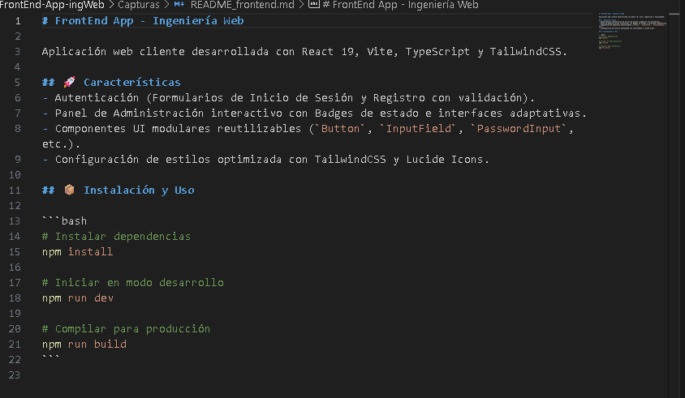
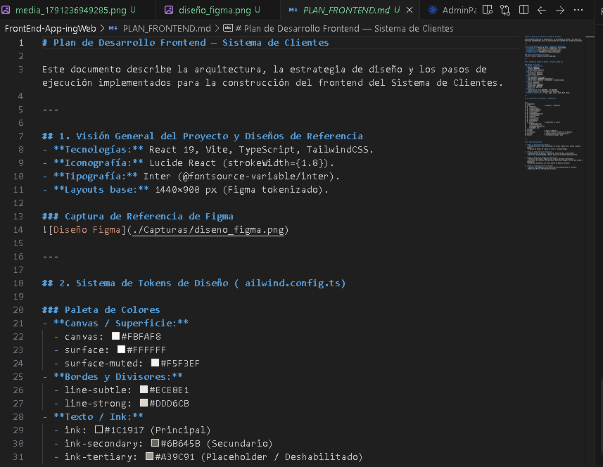

# Plan de Desarrollo Frontend — Sistema de Clientes

Este documento describe la arquitectura, la estrategia de diseño y los pasos de ejecución implementados para la construcción del frontend del Sistema de Clientes.

---

## 1. Visión General del Proyecto y Diseños de Referencia
- **Tecnologías:** React 19, Vite, TypeScript, TailwindCSS.
- **Iconografía:** Lucide React (strokeWidth={1.8}).
- **Tipografía:** Inter (@fontsource-variable/inter).
- **Layouts base:** 1440×900 px (Figma tokenizado).

### Captura de Referencia del Diseño (Figma)

### Capturas del Editor (README y PLAN_FRONTEND)

---

## 2. Sistema de Tokens de Diseño (	ailwind.config.ts)

### Paleta de Colores
- **Canvas / Superficie:**
  - canvas: #FBFAF8
  - surface: #FFFFFF
  - surface-muted: #F5F3EF
- **Bordes y Divisores:**
  - line-subtle: #ECE8E1
  - line-strong: #DDD6CB
- **Texto / Ink:**
  - ink: #1C1917 (Principal)
  - ink-secondary: #6B645B (Secundario)
  - ink-tertiary: #A39C91 (Placeholder / Deshabilitado)
- **Acento (Terracota):**
  - ccent: #B2502A
  - ccent-hover: #9A4322
  - ccent-soft: #F7E7DD
  - ccent-ink: #7A3418
- **Estados:**
  - status-active: Soft #E3F0E7, Ink #1D4D31
  - status-inactive: Soft #EEEAE4, Ink #5C564E
- **Avatares (Squircles):** Clay, Sage, Lilac, Sand, Mist, Rose.

---

## 3. Arquitectura de Carpetas y Componentes

`
src/
├─ components/
│  ├─ ui/                   # Atómicos / Modulares
│  │  ├─ Button/
│  │  ├─ InputField/
│  │  ├─ PasswordInput/
│  │  ├─ SearchInput/
│  │  ├─ Checkbox/
│  │  ├─ SegmentedControl/
│  │  ├─ StatusBadge/
│  │  ├─ Avatar/
│  │  ├─ FilterChip/
│  │  ├─ DataTable/
│  │  └─ SlideOver/
│  └─ layout/               # Organismos de Layout
│     ├─ AuthLayout.tsx
│     ├─ PatternPanel.tsx
│     ├─ DashboardLayout.tsx
│     └─ Sidebar.tsx
├─ features/
│  ├─ auth/                 # Login y Registro
│  └─ clientes/             # Tabla, Filtros, Slide-over de Detalle
├─ services/                # Clientes Axios por microservicio
└─ styles/                  # Tailwind CSS import base
`

---

## 4. Fases de Ejecución

1. **Fase 1: Infraestructura Base**
   - Configuración del tema TailwindCSS con escala tipográfica, bordes y paleta exacta.
   - Creación de helper de clases cn (clsx + 	ailwind-merge).

2. **Fase 2: Componentes UI Atómicos**
   - Implementación de Button, InputField, PasswordInput y SearchInput.
   - Desarrollo de StatusBadge y Avatar squircle con paleta determinística.

3. **Fase 3: Módulos de Pantalla (Features)**
   - Formulario de Login & Registro con layouts partidos (AuthLayout).
   - Directorio de clientes con DataTable, barra de búsqueda, filtros por estado y paginación.
   - Slide-over de detalle con vista previa de datos y acciones.

4. **Fase 4: Integración HTTP y Estado**
   - Conexión con endpoints del microservicio de autenticación y clientes.
   - Manejo de JWT en interceptores de Axios.
